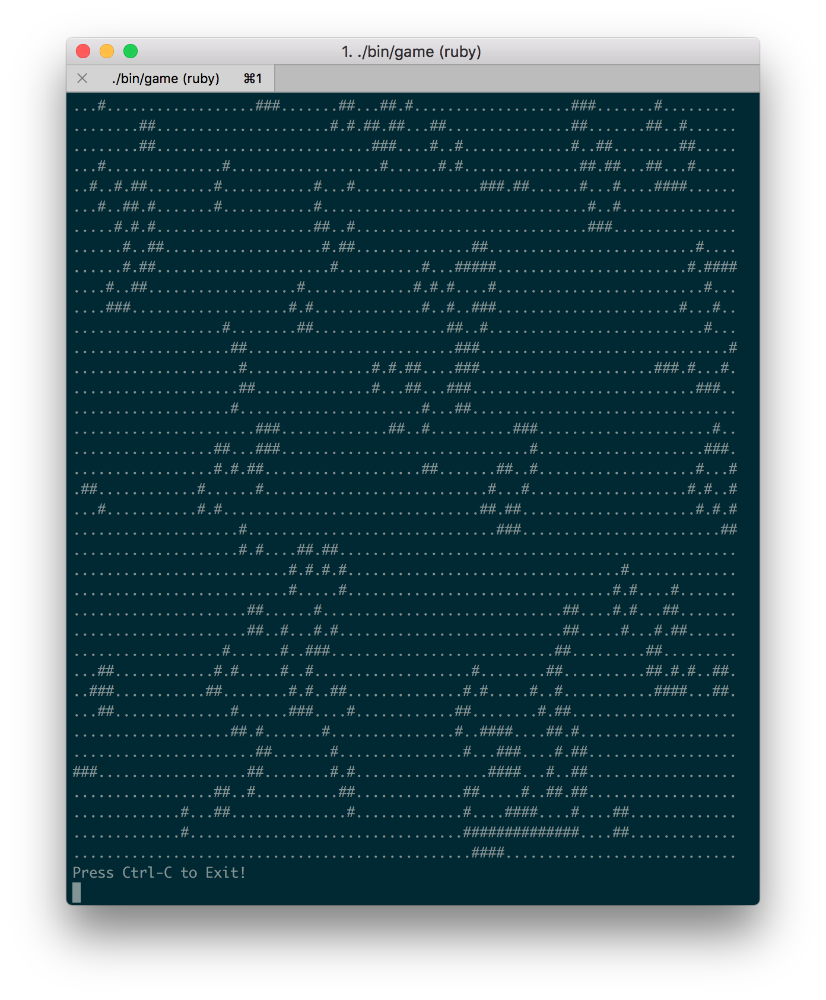

## Game of Life 

Ref: https://en.wikipedia.org/wiki/Conway%27s_Game_of_Life

#### Pre-requirements:

- install Ruby `2.5.1`
- install `bundler`
- run `./bin/setup`

#### Usage

- `./bin/game`

#### Tests

- `rspec spec/`

#### Design

##### class: BoardPresenter

- accepts grid object
- iterates over each cell and formats them depending on cell's state

##### class: GameOfLife

- creates initial `Board`
- ticks `Board` instance every 0.5s
- loops until instance has alive cells

##### class: Board

- aware of its width and height
- composes `Cell` objects
- replaces entire grid on tick
- formats board (via dependency injection - formatter)

##### class: Cell

- aware of its location(x, y)
- its `state` is immutable
- returns new instance based of its own state and neighbours
